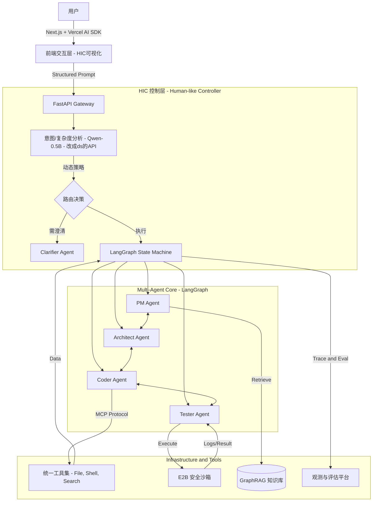

# 产品需求文档 (PRD) - CodePilot Pro
## —— 具备拟人化交互意识的自动化研发助手

| 文档版本     | 修改日期       | 修改人   | 状态        | 备注  |
| :------- | :--------- | :---- | :-------- | :-- |
| **v1.0** | 2026-03-23 | Elera | **Final** |     |

---

## 1. 项目背景与痛点 (Background & Pain Points)

### 1.1 行业现状
当前大模型（LLM）在代码生成领域已具备基础能力，但在实际工程落地中面临三大**交互体验瓶颈**：
1.  **输出冗长且无重点**：无论问题难易，模型倾向于输出“百科全书式”长文，用户阅读负担重，关键信息被淹没。
2.  **反问节奏生硬**：在需求模糊时，模型常一次性抛出所有可能分支（“如果是A...如果是B...”），打断对话流，缺乏自然的人类沟通节奏。
3.  **盲目自信与幻觉**：面对歧义需求，模型往往强行理解并生成错误代码，缺乏“先确认、再执行”的主动澄清意识。

### 1.2 产品目标
构建 **CodePilot Pro**，一个不仅具备**全自动化研发闭环**能力，更拥有**拟人化交互智慧**的多智能体系统。
*   **核心愿景**：从“指令执行机器”进化为“结对编程伙伴”。实现**自适应长度控制**、**单步聚焦澄清**和**主动不确定性管理**。
*   **关键指标 (KPIs)**：
    *   简单任务响应时间缩短 **50%**。
    *   多轮对话平均轮次减少 **30%**（因精准澄清）。
    *   无效/幻觉代码生成率降低 **40%**。

---

## 2. 核心创新：人性化交互控制器 (HIC)
> **这是本项目的灵魂模块**，位于用户输入与执行 Agent 之间，负责调控交互的“温度”与“节奏”。

### 2.1 动态长度自适应引擎 (Adaptive Length Engine)
*   **机制**：
    1.  **意图复杂度分析**：实时判定用户输入为 `Fact` (事实查询), `Task` (具体任务), 或 `Complex` (复杂工程)。
    2.  **Token 预算动态分配**：
        *   `Fact`: 强制 `max_tokens ≤ 150`，仅输出核心结论。
        *   `Task`: 限制 `max_tokens ≤ 800`，结构化步骤，默认折叠细节。
        *   `Complex`: 开放 `max_tokens ≥ 2000`，启用**分段流式输出**。
    3.  **分层展示策略**：前端默认仅展示“摘要/核心代码”，提供 `[展开详细推导]` 按钮，用户按需加载。

### 2.2 单步聚焦澄清机制 (Single-Focus Clarification)
*   **机制**：
    1.  **信息缺口检测**：识别缺失的关键槽位（如：语言、框架、业务场景）。
    2.  **禁止分支预判**：严格禁止生成“如果是A...如果是B...”的预设性长文本。
    3.  **单层追问原则**：每次仅针对**一个**最高优先级的缺失信息进行提问。
    4.  **前端快捷交互**：解析反问意图，动态渲染 **Quick Action Chips** (快捷选项芯片)，用户点击即发送，无需打字。

### 2.3 主动置信度管理 (Active Confidence Management)
*   **机制**：
    1.  **自我反思 (Self-Reflection)**：生成前评估 `Ambiguity_Score` (模糊度) 和 `Assumption_Count` (假设数量)。
    2.  **强制暂停阈值**：若 `Ambiguity > 0.6` 或 `Assumptions > 2`，**拦截生成**，强制触发澄清流程。
    3.  **假设显式声明**：若必须生成，必须在回答首部添加醒目的 ⚠️ **假设声明块**，并提供一键修正入口。

---

## 3. 用户角色 (User Personas)

| 角色 | 描述 | 核心诉求 | CodePilot Pro 解决方案 |
| :--- | :--- | :--- | :--- |
| **初级开发者** | 需要快速搭建原型，常表达模糊。 | “别让我想太细，直接帮我跑起来，但别乱写。” | **主动澄清**：引导式提问 + 快捷选项；**假设声明**：明确告知基于什么生成的。 |
| **高级架构师** | 时间宝贵，只需关键决策支持。 | “别废话，直接给我核心方案和代码，细节我自己看。” | **自适应长度**：默认极简模式，只给结论和核心代码，细节折叠。 |
| **技术面试官** | 考察工程能力与产品思维。 | “这个系统是否有解决真实痛点？架构是否合理？” | **全流程可视化**：展示 HIC 决策过程、Agent 协作状态及沙箱安全机制。 |

---

## 4. 核心功能需求 (Functional Requirements)

### 4.1 智能体角色定义 (Agent Roles)
系统实例化以下核心 Agent，均受 **HIC 控制器** 调度：

| Agent | 职责 | HIC 增强特性 |
| :--- | :--- | :--- |
| **👨‍💼 PM Agent** | 需求拆解与任务规划。 | 输出任务树前，经 HIC 检查是否需向用户确认核心业务目标。 |
| **🏗️ Architect** | 技术选型与文件结构设计。 | 若检测到多种可行架构，**禁止**全部列出，仅推荐最优解并说明理由。 |
| **👨‍💻 Coder** | 编写具体代码。 | 根据 HIC 分配的 Token 预算生成代码；若预算不足，优先生成核心逻辑。 |
| **🧪 Tester** | 运行测试与报错分析。 | 报错反馈时，经 HIC 简化为“人类可读”的修复建议，而非堆砌日志。 |
| **🕵️ Clarifier** | **(新增)** 专职澄清代理。 | 仅在 HIC 判定信息缺失时激活，执行“单步追问”策略。 |

### 4.2 核心工作流 (Core Workflow with HIC)

采用 **LangGraph** 构建带条件中断的状态机：

1.  **输入预处理 (HIC Layer)**:
    *   用户输入 -> HIC 分析 (`complexity`, `ambiguity`, `missing_slots`)。
    *   **决策分支**：
        *   **需澄清** -> 路由至 `Clarifier Agent` -> 生成单步反问 -> **暂停等待用户**。
        *   **无需澄清** -> 进入主流程。

2.  **规划与确认 (PM + HITL)**:
    *   PM 生成任务计划。
    *   **人工确认点**：前端展示精简版计划（HIC 已过滤冗余信息）。用户批准/修改。

3.  **迭代开发循环 (The Loop)**:
    *   **Architect** 设计结构 -> **Coder** 编写代码 (受 Token 预算限制)。
    *   **Tester** 运行沙箱。
    *   **异常处理**：
        *   若报错 -> Tester 分析 -> HIC 判断是否需再次询问用户（如：缺少依赖配置）-> 否则直接反馈给 Coder 修复。
        *   **最大重试**：同一错误 >3 次 -> 触发**人工介入警报**。

4.  **交付与展示**:
    *   生成最终代码包。
    *   前端以**折叠卡片**形式展示结果，核心代码高亮，长文件默认折叠。

### 4.3 非功能性需求 (Non-Functional Requirements)
*   **响应延迟**: HIC 层决策延迟 < 200ms (使用小模型或规则)。
*   **安全性**: 所有代码在 **E2B / Docker** 沙箱运行，严格限制网络与资源。
*   **可观测性**: 记录 HIC 的每一次决策日志（如：“检测到模糊度0.8，触发澄清”），用于调试与演示。

---

## 5. 技术架构方案 (Technical Architecture)

### 5.1 技术栈选型

| 模块     | 技术选型                                       | 选型理由 & 招聘对标                                                                                                               |
| :----- | :----------------------------------------- | :------------------------------------------------------------------------------------------------------------------------ |
| 核心编排框架 | LangGraph (Python)                         | 行业事实标准。相比 LangChain Chain，LangGraph 原生支持循环 (Cycles)、持久化状态 (Persistence) 和人机协同 (Human-in-the-loop)，完美契合多智能体协作场景。_(JD 高频词)_ |
| 协议与连接  | MCP (Model Context Protocol)               | 2026 新晋顶流。采用 Anthropic 推出的开放协议连接内部工具与数据源，解决工具碎片化问题，体现对互操作性的前瞻布局。_(差异化亮点)_                                                 |
| 大模型层   | DEEPSEEK(主)                             |                                                                                                                           |
| 记忆与检索  | GraphRAG + PostgreSQL (pgvector)           | 摒弃传统 RAG，采用 GraphRAG 构建知识图谱，使 Agent 能理解实体间关系，提升复杂任务推理能力。_(高阶岗位必问)_                                                        |
| 沙箱执行   | E2B Sandbox                                | Agent 专用沙箱。相比自建 Docker，E2B 提供秒级启动、文件隔离、网络控制及原生 Python SDK，极大降低安全风险与维护成本。                                                  |
| 评估与观测  | LangSmith / Arize Phoenix                  | 建立自动化评估 (Eval) 流水线，监控 Agent 的任务成功率、幻觉率及延迟，确保生产级可靠性。_(大厂核心痛点)_                                                             |
| 前端交互   | Next.js 14 (App Router)   Vercel AI SDK | 利用 `useChat` Hook 轻松实现流式输出、中间件拦截及自定义 UI 组件 (折叠、芯片)，完美支撑 HIC 控制器的交互需求。                                                     |

### 5.2 系统架构图

---

## 6. 界面交互设计 (UI/UX Wireframe)

*   **对话流区域**:
    *   **AI 回复**: 
        *   若为简短回答：直接显示。
        *   若为长代码/长文：显示摘要 + `[展开查看详情 ▼]` 按钮。
        *   若含假设：顶部显示黄色警告条 `⚠️ 基于假设：使用 MySQL。[修改假设]`。
    *   **AI 反问**: 
        *   显示简洁问题文本。
        *   下方自动浮现 **Quick Action Chips** (如 `[Python]` `[Node.js]` `[其他]`)。
*   **侧边栏**:
    *   **文件树**: 实时更新。
    *   **HIC 状态面板**: (调试用) 显示当前的 `Ambiguity Score`, `Token Budget`, `Active Agent`。
*   **终端窗口**: 嵌入式 `xterm.js`，实时显示构建/运行日志。

---

## 7. 开发路线图 (Roadmap)

| 阶段 | 目标 | 关键交付物 |
| :--- | :--- | :--- |
| **Phase 1: HIC 内核** | 实现意图分类、Token 动态控制、基础澄清逻辑。 | HIC 中间件代码；支持折叠/芯片的前端 Demo。 |
| **Phase 2: Agent 集成** | 将 HIC 接入 LangGraph 多智能体工作流。 | 完整的 PM/Arch/Coder/Test 闭环；单步追问功能。 |
| **Phase 3: 置信度管理** | 实现自我反思与假设声明机制。 | Self-Reflection 模块；假设高亮 UI。 |
| **Phase 4:  polish** | 性能优化、演示视频录制、技术博客撰写。 | 最终产品；面试演示脚本。 |

---

## 8. 风险评估与应对 (Risks & Mitigation)

| 风险 | 描述 | 应对策略 |
| :--- | :--- | :--- |
| **过度澄清** | 用户觉得问得太频繁，体验烦躁。 | 设置“连续澄清阈值”，若连续 2 次澄清无进展，转为“最佳实践假设生成”并强提示。 |
| **误判复杂度** | 将复杂问题误判为简单，导致回答不全。 | 提供“不满意？展开更多”反馈按钮，触发二次生成（高 Token 预算）。 |
| **延迟增加** | HIC 增加额外推理步骤。 | HIC 使用极小模型 (0.5B) 或纯规则，确保额外延迟 < 200ms。 |

---

## 9. 面试展示策略 (Interview Strategy)

### 9.1 演示脚本 (Demo Script)
1.  **场景一（模糊需求）**：输入“帮我写个爬虫”。
    *   *展示*：系统**不再生成代码**，而是反问“目标网站是？”，并弹出 `[GitHub]` `[知乎]` 芯片。
    *   *话术*：“传统模型会直接瞎编代码，而 CodePilot Pro 懂得先问清楚。”
2.  **场景二（复杂需求）**：输入“创建一个电商后台”。
    *   *展示*：系统生成精简的任务计划，代码部分**默认折叠**，仅显示核心架构。
    *   *话术*：“通过自适应长度控制，我们让高级工程师也能高效使用，不被废话打扰。”
3.  **场景三（歧义处理）**：故意给出一个有歧义的数据库指令。
    *   *展示*：系统顶部出现 `⚠️ 假设声明`，并允许一键切换数据库类型。
    *   *话术*：“主动管理不确定性，是区分玩具与生产力工具的关键。”

### 9.2 核心价值主张
> “大多数 AI 项目只关注‘能不能生成代码’（Capability），而 CodePilot Pro 关注‘生成的体验是否像人’（Experience）。我设计的 **HIC 模块** 解决了业界公认的三大交互痛点，使 AI 从‘百科全书’变成了真正的‘结对编程伙伴’。”
